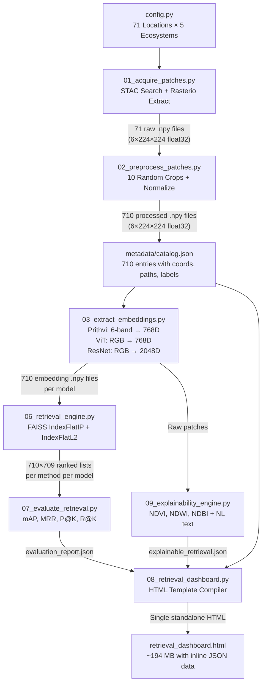

# EcoLens: Multi-Model Ecosystem Retrieval & Explainability Framework
### Comprehensive Architectural, Methodological, and Codebase Specification

> **Purpose:** This document is a master technical specification for the EcoLens codebase. It is designed to be fed verbatim into another LLM or read by a new developer so they can fully understand the architecture, methodology, data flow, every function's purpose, all output data schemas, and all empirical results — without needing to read a single line of source code.

---

## 1. Project Overview & Objectives

**EcoLens** is an **unsupervised** Earth Observation (EO) Content-Based Image Retrieval (CBIR) framework. Given a satellite image of any ecosystem on Earth, it finds the most ecologically similar locations worldwide and explains *why* they are similar using spectral science.

### 1.1 Three Core Objectives
| Objective | Description | Scripts |
|:---|:---|:---|
| **Obj 1: Feature Extraction** | Download Sentinel-2 satellite imagery, preprocess into multi-spectral patches, and extract deep feature embeddings using 3 foundation models | `01`, `02`, `03` |
| **Obj 2: Retrieval & Evaluation** | Build a FAISS vector database, perform similarity search (Cosine, Euclidean, kNN), and rigorously evaluate retrieval quality | `06`, `07` |
| **Obj 3: Explainability & Visualization** | Compute biophysical indicators from raw spectral bands, generate natural-language explanations, and compile an interactive dashboard | `09`, `08` |

### 1.2 Key Design Decisions
- **Unsupervised:** No labeled training data is used. Embeddings come from pre-trained foundation models applied zero-shot.
- **Multi-Model Comparison:** Three models are compared head-to-head to evaluate whether a geospatial foundation model (Prithvi) offers advantages over standard ImageNet models (ViT, ResNet) for ecological retrieval.
- **Multi-Patch per Location:** 10 random spatial crops per location capture intra-class variability (e.g., forest edges vs. dense canopy).
- **Self-Contained Dashboard:** The final output is a single `.html` file with all data embedded inline — no backend server required.

---

## 2. Technology Stack & Dependencies

### 2.1 Python Dependencies (`requirements.txt`)
```
pystac-client          # STAC catalog API client for satellite data discovery
planetary-computer     # Microsoft Planetary Computer authentication
rasterio               # Geospatial raster I/O (reading Sentinel-2 GeoTIFFs)
numpy                  # Array computation
pyyaml                 # YAML config parsing
torch                  # PyTorch deep learning framework
einops                 # Tensor reshaping for ViT architectures
timm                   # PyTorch Image Models library (ViT-Base, ResNet-50)
huggingface_hub        # Download Prithvi-100M model weights
faiss-cpu              # Facebook AI Similarity Search (vector indexing)
tqdm                   # Progress bars
```

### 2.2 Frontend Libraries (loaded via CDN in dashboard HTML)
- **Leaflet.js** v1.9.4 — Interactive geographic map
- **Chart.js** v4.x — PCA scatter plots, radar charts, bar charts
- **CartoDB Dark Matter** tiles — Dark-themed map layer

### 2.3 Model Weights
| Model | Source | Checkpoint | Embedding Dim |
|:---|:---|:---|:---:|
| NASA/IBM Prithvi-100M | HuggingFace `ibm-nasa-geospatial/Prithvi-EO-1.0-100M` | `Prithvi_100M.pt` (454 MB) | 768 |
| ViT-Base/16 | `timm` library (`vit_base_patch16_224`) | auto-downloaded | 768 |
| ResNet-50 | `timm` library (`resnet50`) | auto-downloaded | 2048 |

---

## 3. Directory Structure Map

```yaml
c:\IS\
  ├── 01_acquire_patches.py            # Step 1: Sentinel-2 STAC search & patch download
  ├── 02_preprocess_patches.py         # Step 2: Random crops, normalization, coordinate offsets
  ├── 03_extract_embeddings.py         # Step 3: Multi-model feature extraction (batch inference)
  ├── 04_finalize_and_analyze.py       # Step 4: Legacy utility (triggers indexing)
  ├── 05_create_database_and_dashboard.py  # Step 5: Legacy (superseded by step 08)
  ├── 06_retrieval_engine.py           # Step 6: FAISS indexing + similarity search engine
  ├── 07_evaluate_retrieval.py         # Step 7: IR metrics evaluation (mAP, MRR, P@K, R@K)
  ├── 08_retrieval_dashboard.py        # Step 8: Dashboard HTML generator (Leaflet + Chart.js)
  ├── 09_explainability_engine.py      # Step 9: Biophysical indicators + NL explanations
  │
  ├── config.py                        # Master configuration (all constants, 71 locations, paths)
  ├── config.yaml                      # Prithvi-100M model args (YAML)
  ├── Prithvi_100M_config.yaml         # Prithvi normalization stats (data_mean, data_std)
  ├── prithvi_mae.py                   # PrithviMAE class (ViT encoder with temporal embedding)
  ├── inference.py                     # Inference utilities
  ├── requirements.txt                 # Python dependencies
  ├── README.md                        # Project README
  ├── Prithvi_100M.pt                  # Model checkpoint (454 MB, not in git)
  │
  ├── patches/                         # 71 raw .npy files (shape: 6×224×224 each)
  ├── patches_processed/               # 710 preprocessed .npy files (shape: 6×224×224 each)
  ├── embeddings/                      # 710 Prithvi embeddings (shape: 768 each)
  ├── embeddings_vit/                  # 710 ViT-Base embeddings (shape: 768 each)
  ├── embeddings_resnet/               # 710 ResNet-50 embeddings (shape: 2048 each)
  │
  ├── metadata/
  │   └── catalog.json                 # Master metadata (710 entries)
  │
  ├── results/
  │   ├── retrieval_results_prithvi.json   # 710×709 ranked candidate lists (Prithvi)
  │   ├── retrieval_results_vit.json       # 710×709 ranked candidate lists (ViT)
  │   ├── retrieval_results_resnet.json    # 710×709 ranked candidate lists (ResNet)
  │   ├── analog_database_prithvi.json     # Top-10 analog entries per patch (Prithvi)
  │   ├── analog_database_vit.json         # Top-10 analog entries per patch (ViT)
  │   ├── analog_database_resnet.json      # Top-10 analog entries per patch (ResNet)
  │   ├── evaluation_report.json           # Cross-model performance metrics
  │   ├── ecosystem_descriptors.json       # 710 biophysical descriptor records
  │   └── explainable_retrieval.json       # 710 × 50 pairwise NL explanations
  │
  └── retrieval_dashboard.html             # Compiled standalone dashboard (~194 MB with inline data)
```

---

## 4. Complete Location Database (71 Base Locations)

All 71 locations are defined in `config.py → PATCH_LOCATIONS`. Each generates 10 sub-patches = **710 total patches**.

### 4.1 Location Summary by Ecosystem

| Ecosystem | Count | Example Locations |
|:---|:---:|:---|
| **Forest** | 15 | Periyar (India), Amazon (Brazil), Black Forest (Germany), Redwood NP (USA), Bialowieza (Poland), Siberian Boreal (Russia), Olympic NF (USA), Great Sandy NP (Australia), Daintree (Australia), Congo Basin (Gabon), Mt. Kenya (Kenya), Yakushima (Japan), Valdivian Rainforest (Chile), Jiuzhaigou (China), Sherwood (UK) |
| **Wetland** | 15 | Dudwa (India), Everglades (USA), Pantanal (Brazil), Okavango Delta (Botswana), Kakadu (Australia), Sundarbans Swamps (Bangladesh), Danube Delta (Romania), Camargue (France), Hula Valley (Israel), Llanos (Venezuela), Volga Delta (Russia), Sunderbans Delta (Bangladesh), Peace-Athabasca (Canada), Mesopotamian Marshes (Iraq), Wadden Sea (Netherlands) |
| **Mangrove** | 13 | Sundarbans (India), Florida Bay (USA), Niger Delta (Nigeria), Guayaquil (Ecuador), Pichavaram (India), Bhitarkanika (India), Muara Angke (Indonesia), Madagascar, Red Sea (Egypt), Great Barrier Reef (Australia), Caroni Swamp (Trinidad), Yucatan (Mexico), Guinea-Bissau, Matang (Malaysia), Shark Bay (Australia) |
| **Agricultural** | 15 | Punjab (India), Iowa (USA), Central Valley (USA), Nile Valley (Egypt), Great Plains (USA), Pampas (Argentina), Sichuan (China), Murrumbidgee (Australia), Alentejo (Portugal), Ukraine Black Earth, Canterbury (NZ), Saskatchewan (Canada), Mekong Delta (Vietnam), Cerrado (Brazil), Hokkaido (Japan) |
| **Urban Green** | 14 | Cubbon Park (Bangalore), Central Park (NYC), Hyde Park (London), Bois de Boulogne (Paris), Golden Gate Park (SF), Tiergarten (Berlin), Shinjuku Gyoen (Tokyo), Ibirapuera (São Paulo), Centennial Park (Sydney), Chapultepec (Mexico City), Royal Botanic Gardens (Melbourne), Stanley Park (Vancouver), Lumpini (Bangkok), Singapore Botanic Gardens, Lodhi Gardens (Delhi) |

### 4.2 Metadata Schema per Location (in `config.py`)
```python
{
    "id": "forest_001",              # Unique ID (ecosystem_NNN format)
    "ecosystem": "forest",           # Category label (5 classes)
    "lon": 76.6320,                  # Longitude (WGS84)
    "lat": 9.4981,                   # Latitude (WGS84)
    "name": "Periyar forest, Kerala, India",
    "protected_area": True,          # WDPA conservation designation
    "climatic_region": "Tropical Monsoon"   # Köppen-derived climate zone
}
```

### 4.3 Sentinel-2 Band Configuration
The 6 spectral bands used, matching NASA/IBM Prithvi-100M's training format:

| Index | Band Name | Sentinel-2 Code | Native Resolution | Wavelength |
|:---:|:---|:---:|:---:|:---|
| 0 | Blue | B02 | 10m | 490 nm |
| 1 | Green | B03 | 10m | 560 nm |
| 2 | Red | B04 | 10m | 665 nm |
| 3 | NIR (Narrow) | B8A | 20m | 865 nm |
| 4 | SWIR 1 | B11 | 20m | 1610 nm |
| 5 | SWIR 2 | B12 | 20m | 2190 nm |

---

## 5. End-to-End Pipeline Data Flow



---

## 6. Detailed Script-by-Script Function Reference

### 6.1 `01_acquire_patches.py` — Satellite Data Acquisition

**Purpose:** Queries Microsoft Planetary Computer's STAC catalog for Sentinel-2 L2A scenes, extracts fixed-size multi-band patches.

| Function | Signature | Purpose |
|:---|:---|:---|
| `search_best_scene` | `(catalog, lon, lat, buffer_deg=0.05) → pystac.Item or None` | Searches STAC for the least-cloudy Sentinel-2 L2A scene within date range `2024-01-01/2024-06-30` and cloud cover < 15% |
| `extract_patch` | `(item, lon, lat, patch_size_m, patch_size_px, band_map) → np.ndarray` | Extracts a `(6, 224, 224)` patch centered on `(lon, lat)`. Reprojects center to UTM, reads 2240m × 2240m window, resamples all bands (including 20m bands) to 224×224 using bilinear interpolation |
| `main` | `() → None` | Iterates all 71 locations, saves `.npy` files to `patches/`, writes `metadata/catalog.json` |

**Output data shape:** Each `.npy` file is `np.float32` array of shape `(6, 224, 224)` — raw DN values in range `[0, 10000]`.

**Catalog entry schema (after this step):**
```json
{
    "id": "forest_001",
    "ecosystem": "forest",
    "name": "Periyar forest, Kerala, India",
    "lon": 76.632, "lat": 9.4981,
    "protected_area": true,
    "climatic_region": "Tropical Monsoon",
    "scene_id": "S2B_MSIL2A_...",
    "scene_date": "2024-03-15T...",
    "cloud_cover_pct": 2.3,
    "patch_path": "patches/forest_001.npy",
    "patch_shape": [6, 224, 224],
    "bands": ["blue", "green", "red", "nir", "swir1", "swir2"]
}
```

---

### 6.2 `02_preprocess_patches.py` — Multi-Patch Expansion & Normalization

**Purpose:** Converts 71 base patches into 710 normalized sub-patches via deterministic random cropping.

| Function | Signature | Purpose |
|:---|:---|:---|
| `load_prithvi_norm_stats` | `(config_path) → (means, stds)` | Loads per-band mean/std arrays from `Prithvi_100M_config.yaml` for Z-score normalization |
| `to_reflectance` | `(raw_patch) → np.ndarray` | Converts raw DN to surface reflectance: `patch / 10000.0` |
| `handle_nodata` | `(patch, nodata_value=0) → np.ndarray` | Replaces zero-value pixels with per-band median to avoid normalization distortion |
| `normalize` | `(patch, means, stds) → np.ndarray` | Z-score normalization: `(clip(patch, 0, 10000) - means) / stds` |
| `resize_patch_torch` | `(patch_np, target_size=224) → np.ndarray` | Bilinear upscaling from crop size (160×160) back to model input size (224×224) |
| `calculate_offset_coords` | `(lat, lon, dy, dx) → (new_lat, new_lon)` | Computes geographic coordinate offsets for each sub-patch |

**Random Crop Algorithm (detailed):**
```
For each of 71 base patches:
    1. Compute deterministic seed: h_val = sum(ord(c) for c in base_id)
    2. Create RNG: rng = np.random.default_rng(h_val)
    3. Generate 10 unique (dy, dx) offsets, each in [-32, +32]
    4. For each offset:
        a. Compute crop top-left: row = 32 + dy, col = 32 + dx
        b. Extract crop: patch[:, row:row+160, col:col+160]  → shape (6, 160, 160)
        c. Resize to (6, 224, 224) via bilinear interpolation
        d. Handle nodata pixels (replace zeros with band medians)
        e. Z-score normalize with Prithvi training statistics
        f. Save as patches_processed/{base_id}_p{0..9}_processed.npy
        g. Compute offset lat/lon for the crop center
```

**Why 160×160 crop from 224×224?**
- Margin of 32px on each side allows ±32px displacement range.
- `32 + (-32) = 0` (top edge), `32 + 32 = 64`, so crop spans pixels `[0..160]` to `[64..224]`.
- This ensures all crops stay within the original tile bounds.

---

### 6.3 `03_extract_embeddings.py` — Multi-Model Feature Extraction

**Purpose:** Runs batch forward passes through 3 models to produce L2-normalized embeddings.

| Function | Signature | Purpose |
|:---|:---|:---|
| `load_prithvi_model` | `() → PrithviMAE` | Loads Prithvi-100M checkpoint, strips pos_embed keys, moves to GPU/CPU |
| `extract_embedding` | `(model, patch_tensor) → np.ndarray[768]` | Prithvi forward pass: inserts T=1 dim → `(1, 6, 1, 224, 224)`, runs `forward_features`, mean-pools patch tokens (drops CLS), returns 768D vector |
| `load_timm_model` | `(model_name) → nn.Module` | Loads pretrained timm model with `num_classes=0` (feature extraction mode) |
| `prepare_rgb_tensor` | `(raw_patch) → torch.Tensor[3, 224, 224]` | Extracts RGB bands (indices 2,1,0 from raw 6-band), scales to [0,1], applies ImageNet normalization |
| `extract_timm_embedding` | `(model, rgb_tensor) → np.ndarray` | Runs timm model forward pass → pooled feature vector (768D for ViT, 2048D for ResNet) |
| `run_prithvi` | `(catalog) → catalog` | Batch-processes all 710 patches through Prithvi in batches of 16 |
| `run_timm_model` | `(catalog, model_key) → catalog` | Batch-processes all 710 patches through ViT or ResNet in batches of 16 |

**Critical Detail — L2 Normalization:**
After extracting every embedding, it is immediately L2-normalized:
```python
emb /= np.linalg.norm(emb) + 1e-8
```
This ensures that inner-product search (`faiss.IndexFlatIP`) produces cosine similarity scores.

**Input/Output Data Flow:**

| Model | Input Shape | Input Source | Output Shape | Output Directory |
|:---|:---|:---|:---|:---|
| Prithvi-100M | `(B, 6, 1, 224, 224)` | `patches_processed/*.npy` (normalized 6-band) | `(768,)` per patch | `embeddings/` |
| ViT-Base | `(B, 3, 224, 224)` | `patches/*.npy` (raw RGB extracted, ImageNet-normalized) | `(768,)` per patch | `embeddings_vit/` |
| ResNet-50 | `(B, 3, 224, 224)` | `patches/*.npy` (raw RGB extracted, ImageNet-normalized) | `(2048,)` per patch | `embeddings_resnet/` |

**Important:** Prithvi uses the **preprocessed** 6-band patches. ViT and ResNet use the **raw** patches (only RGB bands, with their own ImageNet normalization).

---

### 6.4 `06_retrieval_engine.py` — FAISS Vector Search Engine

**Purpose:** Indexes all embeddings into FAISS and runs leave-one-out retrieval for every patch.

#### Class: `EcosystemRetrievalEngine`

**Constructor:** `__init__(self, catalog, embeddings)`
- Stacks all embedding vectors into a matrix `(N, D)` where N=710.
- Re-normalizes for cosine safety.
- Builds two FAISS indices:
  - `self.index_cos = faiss.IndexFlatIP(D)` — for cosine similarity (adds normalized matrix)
  - `self.index_l2 = faiss.IndexFlatL2(D)` — for Euclidean distance (adds raw matrix)

**Methods:**

| Method | Signature | Purpose |
|:---|:---|:---|
| `search` | `(query_id, method, top_k) → list[dict]` | Search for top-K similar patches. Excludes self-match. Returns ranked list with scores. |
| `search_all` | `(method, top_k) → dict` | Runs `search()` for every patch as a query (leave-one-out evaluation) |
| `build_analog_database` | `(method, top_k) → list[dict]` | Builds the analog database: for each patch, stores query metadata + top-K analogs |

**Three Similarity Methods:**

| Method | FAISS Index | Score Formula | Score Range |
|:---|:---|:---|:---|
| `cosine` | `IndexFlatIP` | `score = dot(q_norm, db_norm)` | [-1, 1] (typically [0.5, 1.0]) |
| `euclidean` | `IndexFlatL2` | `score = 1 / (1 + sqrt(L2_dist))` | (0, 1] |
| `knn` | `IndexFlatL2` | `distance = sqrt(L2_dist)`, `score = 1 / (1 + distance)` | (0, 1] |

**Output:** For each model, a `retrieval_results_{model}.json` file containing:
```json
{
    "cosine": {
        "forest_001_p0": [
            {"id": "forest_003_p2", "ecosystem": "forest", "name": "...", "score": 0.9723, "rank": 1},
            ...  // 709 candidates ranked by score
        ],
        ...  // 710 queries total
    },
    "euclidean": { ... },
    "knn": { ... }
}
```

---

### 6.5 `07_evaluate_retrieval.py` — Retrieval Quality Evaluation

**Purpose:** Computes standard Information Retrieval metrics across all models and methods.

#### Metric Functions

| Function | Formula | What It Measures |
|:---|:---|:---|
| `precision_at_k(retrieved, relevant_set, k)` | `count(relevant in top_k) / k` | Of top-K results, what fraction are correct? |
| `recall_at_k(retrieved, relevant_set, k)` | `count(relevant in top_k) / total_relevant` | Of all correct answers, what fraction appear in top-K? |
| `average_precision(retrieved, relevant_set)` | `mean(precision_at_rank_i for each relevant hit i)` | Quality of entire ranked list (higher = relevant items ranked earlier) |
| `reciprocal_rank(retrieved, relevant_set)` | `1 / rank_of_first_relevant_item` | How early does the first correct answer appear? |

**Relevance Definition:** A retrieved candidate is **relevant** if `candidate.ecosystem == query.ecosystem` (same category label, excluding the query itself).

**Confusion Matrix:** For each query ecosystem, counts how many of the top-K results belong to each ecosystem category. Normalized to proportions.

**Output:** `results/evaluation_report.json` with structure:
```json
{
    "prithvi": {
        "cosine": {
            "overall": {"mAP": 0.3735, "MRR": 0.9744, "P@1": 0.9718, ...},
            "per_category": {
                "forest": {"mAP": 0.384, "MRR": 1.0, "P@1": 1.0, ...},
                ...
            },
            "confusion_matrix": {
                "forest": {"forest": 0.918, "wetland": 0.009, ...},
                ...
            }
        },
        "euclidean": { ... },
        "knn": { ... }
    },
    "resnet": { ... },
    "vit": { ... }
}
```

---

### 6.6 `09_explainability_engine.py` — Biophysical Indicators & NL Explanations

**Purpose:** Extracts land-cover descriptors from raw spectral bands and generates human-readable explanations.

#### Spectral Index Formulas (computed from raw patches)

| Index | Formula | What It Detects |
|:---|:---|:---|
| **NDVI** | `(NIR - Red) / (NIR + Red + ε)` | Vegetation density & health |
| **NDWI** | `(Green - NIR) / (Green + NIR + ε)` | Open water surfaces |
| **NDBI** | `(SWIR1 - NIR) / (SWIR1 + NIR + ε)` | Built-up / bare soil areas |

#### Land Cover Classification Thresholds

| Cover Type | Decision Rule | Output Field |
|:---|:---|:---|
| **Forest** | `NDVI > 0.45 AND NDWI < 0.1 AND NDBI < 0.1` | `forest_cover` (% of pixels) |
| **Water** | `NDWI > 0.0` | `water_cover` (% of pixels) |
| **Urban/Bare** | `NDBI > 0.0 AND NDVI < 0.35 AND NDWI < 0.0` | `urban_cover` (% of pixels) |
| **Vegetation Health** | `mean(NDVI where NDVI > 0.2)` | `veg_health` (0-1 scale) |

#### Physical Descriptors (heuristic simulation)

| Field | Source | Example Values |
|:---|:---|:---|
| `elevation` | Latitude + ecosystem heuristic | Mangroves: 2-42m; Montane: 2500-3700m |
| `temp` | Latitude band lookup | Tropical (<12°): 25-28°C; Boreal (>50°): 2-8°C |
| `rainfall` | Ecosystem + latitude | Rainforest: 2200-3550mm; Semi-arid: 550-1000mm |
| `soil` | Ecosystem + name matching | Mangrove→"Saline Clay"; Forest→"Oxisol/Ferralsol" |
| `ecoregion` | Name-based matching | "Amazonian Moist Forests", "Sundarbans Mangroves" |

#### NL Explanation Generation (`generate_explanation`)
Compares 7 factor categories between query and analog:
1. **Forest cover difference** (threshold: <15%)
2. **Water cover difference** (threshold: <12%)
3. **Urban/bare cover difference** (threshold: <15%)
4. **Vegetation health (NDVI) difference** (threshold: <0.08)
5. **Temperature difference** (threshold: <3.5°C)
6. **Rainfall difference** (threshold: <300mm)
7. **Elevation difference** (threshold: <200m)
8. **Ecoregion match** (exact string match)
9. **Soil type match** (exact string match)
10. **Protected area status match**

Matching factors are assembled into natural language: *"These two ecosystems are considered similar because both exhibit high forest canopy coverage (62.3% vs 58.1%), matching temperature profiles (25.5°C vs 26.0°C), and shared conservation status."*

**Output:** `explainable_retrieval.json` containing:
```json
{
    "descriptors": {
        "forest_001_p0": {
            "forest_cover": 65.23,
            "water_cover": 2.15,
            "urban_cover": 1.87,
            "veg_health": 0.5234,
            "protected_area": true,
            "elevation": 920.0,
            "temp": 25.5,
            "rainfall": 2350.0,
            "soil": "Oxisol / Ferralsol",
            "ecoregion": "South Western Ghats Moist Forests"
        },
        ...  // 710 entries
    },
    "explanations": {
        "forest_001_p0": {
            "forest_003_p2": {
                "explanation": "These two ecosystems are considered similar because...",
                "metrics": {
                    "forest_diff": 7.12,
                    "water_diff": 1.34,
                    "urban_diff": 0.52,
                    "veg_health_diff": 0.0312,
                    "elev_diff": 150.0,
                    "temp_diff": 2.1,
                    "rain_diff": 200.0
                }
            },
            ...  // 50 analog comparisons
        },
        ...  // 710 queries
    }
}
```

---

## 7. Empirical Performance Metrics

### 7.1 Overall Cross-Model Comparison (Cosine Similarity, 710 queries)

| Metric | NASA/IBM Prithvi-100M | ResNet-50 (ImageNet) | ViT-Base (ImageNet) |
|:---|:---:|:---:|:---:|
| **mAP** | 0.3735 | **0.4722** | 0.4340 |
| **MRR** | 0.9744 | 0.9744 | 0.9744 |
| **P@1** | 0.9718 | 0.9718 | 0.9718 |
| **P@3** | 0.9718 | 0.9718 | 0.9718 |
| **P@5** | 0.9701 | **0.9718** | **0.9718** |
| **P@10** | 0.9063 | **0.9225** | 0.9183 |
| **R@10** | 0.0641 | **0.0652** | 0.0649 |

### 7.2 Per-Category mAP (Cosine Similarity)

| Ecosystem | Prithvi | ResNet | ViT |
|:---|:---:|:---:|:---:|
| Agricultural | 0.3138 | **0.3871** | 0.3685 |
| Forest | 0.3840 | **0.4907** | 0.3988 |
| Mangrove | **0.3058** | 0.3013 | 0.3150 |
| Urban Green | 0.5546 | **0.7597** | 0.6943 |
| Wetland | 0.3080 | **0.4144** | 0.3923 |

### 7.3 Confusion Matrices (Cosine, Prithvi-100M, P@10 proportions)

**Prithvi-100M Confusion Matrix:**

| Query ↓ / Retrieved → | Forest | Wetland | Mangrove | Urban Green | Agricultural |
|:---|:---:|:---:|:---:|:---:|:---:|
| **Forest** | **0.918** | 0.009 | 0.011 | 0.054 | 0.007 |
| **Wetland** | 0.028 | **0.911** | 0.033 | 0.016 | 0.011 |
| **Mangrove** | 0.012 | 0.020 | **0.798** | 0.009 | 0.162 |
| **Urban Green** | 0.025 | 0.000 | 0.000 | **0.968** | 0.007 |
| **Agricultural** | 0.027 | 0.013 | 0.015 | 0.019 | **0.927** |

**ResNet-50 Confusion Matrix:**

| Query ↓ / Retrieved → | Forest | Wetland | Mangrove | Urban Green | Agricultural |
|:---|:---:|:---:|:---:|:---:|:---:|
| **Forest** | **0.947** | 0.020 | 0.013 | 0.013 | 0.007 |
| **Wetland** | 0.029 | **0.957** | 0.000 | 0.000 | 0.014 |
| **Mangrove** | 0.008 | 0.000 | **0.762** | 0.000 | 0.231 |
| **Urban Green** | 0.007 | 0.000 | 0.000 | **0.993** | 0.000 |
| **Agricultural** | 0.013 | 0.013 | 0.027 | 0.007 | **0.940** |

### 7.4 Scientific Analysis: Why ResNet-50 Outperforms Prithvi on Label-Based Metrics

1. **Semantic Category Alignment:** Ground-truth labels are human-defined visual categories. ResNet-50, trained on 1M ImageNet images, excels at discriminating textures, colors, and shapes (tree canopy vs. grass vs. water). These visual features align directly with human ecosystem labels.

2. **Prithvi's Spectral Cross-Category Matching:** Prithvi uses NIR and SWIR bands that are invisible to humans. These bands detect:
   - **Leaf water content** (SWIR absorption)
   - **Canopy structure** (NIR reflectance)
   - **Soil moisture** (SWIR absorption)
   
   This causes Prithvi to match a wet temperate rainforest (Chile) with a humid subtropical wetland (India) — spectrally similar but crossing human category labels.

3. **The Mangrove Confusion:** Note the Prithvi confusion matrix shows mangroves being confused with agricultural at 16.2%. Mangrove spectral signatures (high moisture + vegetation) resemble irrigated cropland in NIR/SWIR. This is a well-documented challenge in remote sensing literature.

4. **Urban Green Strength:** All models excel at urban green spaces (P@10 > 96.8%) because parks have highly distinctive spectral+spatial signatures: small vegetation patches surrounded by built-up areas.

---

## 8. Dashboard Architecture (`08_retrieval_dashboard.py`)

### 8.1 How It Works
This script is a **Python template compiler** — it reads all JSON result files and embeds them as inline JavaScript variables inside an HTML template, producing a self-contained single-file dashboard.

**Data embedded inline:**
- `catalog.json` → 710 patch metadata entries
- `evaluation_report.json` → cross-model performance metrics
- `explainable_retrieval.json` → descriptors + NL explanations
- PCA coordinates (computed at compile time via `sklearn.decomposition.PCA`)

### 8.2 Dashboard UI Components

| Component | Technology | Location | Description |
|:---|:---|:---|:---|
| **PCA Scatter Plot** | Chart.js | Left column, top | 710 points colored by ecosystem. Click a point → triggers search. Query highlighted as gold `rectRot` marker. |
| **Leaflet Map** | Leaflet.js | Left column, bottom | 71 base locations plotted. On search: flies to zoom 2 (global view), draws dashed lines from query to top-5 analogs. User can zoom in/out manually. |
| **Location Selector** | HTML `<select>` | Right column, top | Dropdown listing all 71 locations. Selecting triggers retrieval. |
| **Patch Selector** | HTML `<select>` | Right column, top | Sub-patch dropdown (p0–p9). |
| **Query Info Card** | HTML table | Right column | Shows ecosystem, coordinates, climatic region, protected status. |
| **Model Selector** | Radio buttons | Right column | Switch between Prithvi, ViT, ResNet results. |
| **Top-5 Analogs List** | HTML cards | Right column | Each card shows: rank, name, score, ecosystem badge, distance tag. Click → shows radar chart comparison. |
| **Radar Comparison Chart** | Chart.js | Right column | Overlays query vs. selected analog on 6 axes: NDVI, Canopy, Water, Urban, Temperature, Elevation. Normalized to 0-100 scale. |
| **Explanation Panel** | HTML paragraph | Right column, bottom | Natural language explanation from `explainable_retrieval.json`. |

### 8.3 Dashboard Interaction Flow
```
User selects location → JS groups sub-patches → picks first sub-patch →
  → Searches embedded retrieval data for top candidates →
  → Groups by base location (best score per location) →
  → Updates PCA chart (highlights query) →
  → Flies Leaflet map to zoom 2 (global) →
  → Draws dashed lines to top-5 analog locations →
  → Renders top-5 analog cards →
  → User clicks analog card →
  → Shows radar chart + NL explanation
```

---

## 9. Configuration Constants Reference (`config.py`)

| Constant | Value | Description |
|:---|:---|:---|
| `PATCH_SIZE_PX` | 224 | Pixel dimensions of each patch |
| `PATCH_SIZE_M` | 2240 | Ground coverage in meters (224 × 10m/px) |
| `PC_STAC_URL` | `https://planetarycomputer.microsoft.com/api/stac/v1` | Microsoft Planetary Computer STAC endpoint |
| `SEARCH_DATE_RANGE` | `"2024-01-01/2024-06-30"` | Temporal window for scene search |
| `MAX_CLOUD_COVER` | 15 | Maximum acceptable cloud cover percentage |
| `DEFAULT_TOP_K` | 10 | Default number of retrieval results |
| `EVALUATION_K_VALUES` | `[1, 3, 5, 10]` | K values for P@K and R@K evaluation |
| `IMAGENET_MEAN` | `[0.485, 0.456, 0.406]` | ImageNet RGB normalization means |
| `IMAGENET_STD` | `[0.229, 0.224, 0.225]` | ImageNet RGB normalization std devs |
| `DEFAULT_MODEL` | `"prithvi"` | Default model for CLI scripts |

---

## 10. Output Data File Reference

| File | Size | Records | Schema |
|:---|:---:|:---:|:---|
| `metadata/catalog.json` | ~1 MB | 710 | `{id, ecosystem, name, lat, lon, patch_path, processed_path, embedding_path, ...}` |
| `retrieval_results_prithvi.json` | ~538 MB | 710 × 709 × 3 methods | `{method: {query_id: [{id, score, rank, ecosystem, ...}]}}` |
| `retrieval_results_vit.json` | ~538 MB | same | same |
| `retrieval_results_resnet.json` | ~538 MB | same | same |
| `analog_database_prithvi.json` | ~2.6 MB | 710 × 10 | `[{query_id, query_ecosystem, analogs: [{id, score, rank, ...}]}]` |
| `evaluation_report.json` | ~35 KB | 3 models × 3 methods | `{model: {method: {overall, per_category, confusion_matrix}}}` |
| `ecosystem_descriptors.json` | ~220 KB | 710 | `{patch_id: {forest_cover, water_cover, urban_cover, veg_health, ...}}` |
| `explainable_retrieval.json` | ~24 MB | 710 × 50 | `{descriptors: {...}, explanations: {query: {analog: {explanation, metrics}}}}` |
| `retrieval_dashboard.html` | ~194 MB | 1 | Self-contained HTML with all data inline |

---

## 11. Developer & LLM Execution Guide

### 11.1 Sequential Execution Order
```bash
# Step 1: Download satellite patches (requires internet + Planetary Computer)
python 01_acquire_patches.py

# Step 2: Generate 10 random crops per location (71 → 710 patches)
python 02_preprocess_patches.py

# Step 3: Extract embeddings (run separately for each model)
python 03_extract_embeddings.py --model prithvi
python 03_extract_embeddings.py --model vit
python 03_extract_embeddings.py --model resnet

# Step 6: Run FAISS retrieval (run separately for each model)
python 06_retrieval_engine.py --model prithvi
python 06_retrieval_engine.py --model vit
python 06_retrieval_engine.py --model resnet

# Step 7: Evaluate retrieval quality (auto-discovers all models)
python 07_evaluate_retrieval.py

# Step 9: Compute biophysical indicators & explanations
python 09_explainability_engine.py

# Step 8: Compile interactive dashboard
python 08_retrieval_dashboard.py

# Serve dashboard locally
python -m http.server 8000
# Open http://localhost:8000/retrieval_dashboard.html
```

### 11.2 Key Gotchas for Extending This Codebase
1. **Prithvi expects `(B, C, T, H, W)` input** with T=1 temporal dimension. Forgetting the time axis will crash.
2. **ViT and ResNet use raw patches, not preprocessed ones.** They extract RGB bands (indices 2,1,0) from the raw 6-band array and apply their own ImageNet normalization.
3. **All embeddings must be L2-normalized before FAISS indexing.** The cosine similarity search relies on this.
4. **The dashboard HTML is ~194 MB** because it embeds all retrieval data inline. This is intentional for portability.
5. **Confusion matrix values are P@10 proportions**, not absolute counts.
6. **The `_p0` through `_p9` suffix** on patch IDs indicates the sub-patch index. The base location ID is everything before `_p`.
7. **Steps 4 and 5 are legacy** and not required in the current pipeline.

### 11.3 Adding a New Model
1. Add entry to `config.py → SUPPORTED_MODELS` with `label`, `embedding_dim`, `embeddings_dir`, `timm_name`.
2. Run `03_extract_embeddings.py --model <new_key>`.
3. Run `06_retrieval_engine.py --model <new_key>`.
4. Run `07_evaluate_retrieval.py` (auto-discovers new results).
5. Run `08_retrieval_dashboard.py` to rebuild dashboard.

### 11.4 Adding a New Location
1. Add entry to `config.py → PATCH_LOCATIONS` with `id`, `ecosystem`, `lon`, `lat`, `name`, `protected_area`, `climatic_region`.
2. Re-run the full pipeline from step 01 onwards.
