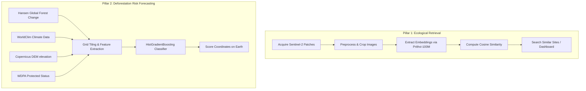

# EcoLens Project Report: Ecological Site Retrieval & Forest-Loss Forecasting

Welcome to the **EcoLens** project report. This document details the goals, architecture, datasets, machine learning techniques, and final results of the EcoLens system. It is written in clear, human-understandable language for developers, researchers, and stakeholders.

---

## 1. Executive Summary

**EcoLens** is an advanced ecological intelligence system designed to do two primary tasks:
1. **Ecological Site Retrieval**: Given a satellite image of any location (e.g., a specific wetland or mangrove patch), find other places in the world that share similar ecological profiles.
2. **Forest-Loss Risk Forecasting**: Predict the probability of a specific forest patch suffering tree-cover loss (deforestation or fires) within a 2-year window using a combination of historical satellite changes, climate variables, and topography.

---

## 2. Project Architecture

The project is structured into two core pillars:



---

## 3. Pillar 1: Ecological Site Retrieval (How it Works)

This pillar allows users to search for similar ecosystems globally using Sentinel-2 satellite imagery.

### Step-by-Step Implementation:
1. **Patch Acquisition (Steps 01-02)**: Satellite imagery is fetched and preprocessed into uniform crops (patches) for 5 distinct ecosystem categories: *Forests, Wetlands, Mangroves, Agricultural fields, and Urban Green spaces*.
2. **AI Feature Extraction (Step 03)**: The patches are passed through **NASA/IBM's Prithvi-100M model**, a geospatial Vision Transformer (ViT) pre-trained on massive multispectral satellite data. Prithvi translates the visual information of the satellite patch into a dense numeric vector (an *embedding*).
3. **Similarity Search (Steps 04-06)**: When you query a location, the system calculates the **Cosine Similarity** between your query's vector and all other vectors in the global database to rank the closest matches.
4. **Generalization Evaluation (Step 07)**: To ensure the model is actually recognizing ecological similarities rather than just identifying neighboring photos of the same forest, we evaluate using a **leave-one-location-out (grouped)** methodology.

---

## 4. Pillar 2: Forest-Loss Risk Forecasting (How it Works)

This pillar forecasts the risk of deforestation at any coordinate on Earth over a 2-year horizon.

### The Dataset (125,268 Data Points)
The model is trained on a dataset generated by dividing 15 global forest regions into small grid cells over a 17-year period (2005–2021). For each cell-year, the system extracts:
* **Baseline Tree Cover (%)**: The initial percentage of forest canopy.
* **Distance to Prior Loss (meters)**: How close the cell is to existing deforestation.
* **Annual Mean Temperature (°C)**: WorldClim v2 climate baseline.
* **Annual Precipitation (rainfall in mm)**: WorldClim v2 climate baseline.
* **Elevation (meters)**: Height above sea level from the Copernicus Digital Elevation Model.
* **Terrain Ruggedness (meters)**: Standard deviation of elevation in a local window, indicating steepness or mountainous slopes.
* **Protected Area (True/False)**: Whether the cell lies inside a park or reserve protected under the World Database on Protected Areas (WDPA).

### The Machine Learning Model
The model uses a **Histogram-Based Gradient Boosting Classifier (HistGradientBoostingClassifier)**. This model is exceptionally well-suited for tabular environmental datasets because:
* It natively handles missing data (e.g., if a climate tile is missing for a point).
* It is extremely fast at processing large tables.
* It captures complex, non-linear relationships between climate, terrain, and logging behaviors.

---

## 5. Results & Human-Language Interpretation

### The Core Numbers
After training and validating on historical data, the model achieved outstanding scores:
* **Average Precision (PR-AUC): `0.7049`**
* **ROC-AUC: `0.8940`**

### What do these metrics mean in plain English?
* **Why we use PR-AUC**: Deforestation is a rare event (only ~27% of forest cells suffer loss within 2 years). Standard accuracy is a misleading metric here (a dumb model that predicts "no loss" everywhere would be 73% accurate but useless). **PR-AUC** measures how good the model is at catching actual risk without raising false alarms. A score of **`0.7049`** means the model is highly precise and reliable.
* **How to use risk thresholds**:
  * **High-Alert Warnings (Threshold: `86.2%` risk)**: If the system flags a pixel at this level, there is an **`81.0%` probability** that it will be deforested within 2 years.
  * **Balanced Alerts (Threshold: `81.0%` risk)**: Flagging at this level catches **50% of all future forest loss** with a **`73.1%` accuracy rate** on the alerts.

---

### What features drive deforestation risk? (Feature Importance)

The machine learning model scored the importance of each feature by shuffling them and measuring the drop in predictive performance:

| Feature Name | Drop in Accuracy (Importance) | Human-Language Interpretation |
| :--- | :--- | :--- |
| **Annual Temperature (`temp_c`)** | **`+0.1423`** | **#1 Driver**. High risk is heavily concentrated in warmer tropical zones where agricultural clearing is most active. |
| **Distance to Prior Loss (`distance_to_prior_loss_m`)** | **`+0.1088`** | **#2 Driver**. Deforestation spreads like a contagion. If logging is happening nearby, your cell is at extreme risk. |
| **Elevation (`elevation_m`)** | **`+0.1041`** | **#3 Driver**. Elevation acts as a physical barrier. High mountains are naturally protected from timber extraction due to difficulty of access. |
| **Annual Rainfall (`rainfall_mm`)** | **`+0.1032`** | Wet tropical rainforests experience different clearing profiles compared to dry woodlands. |
| **Baseline Tree Cover (`baseline_treecover_pct`)** | **`+0.0330`** | Denser forests contain more valuable timber and are targeted more frequently. |
| **Protected Area Status (`protected_area`)** | **`+0.0201`** | Being located inside a national park or reserve significantly reduces the likelihood of logging. |
| **Terrain Ruggedness (`ruggedness_m`)** | **`+0.0084`** | Rugged, steep slopes are harder for heavy machinery to access, reducing risk compared to flat plains. |

---

## 6. How to Run the Code

To train the model, validate it, or perform single-point predictions, use the following commands in your powershell terminal (ensure the virtual environment `.venv` is active):

### 1. Re-train the model
```powershell
.venv\Scripts\python.exe 11_forest_risk_forecast.py
```

### 2. Run leave-one-location-out validation (Spatial Holdout)
Test how well the model generalizes to parts of the world it has never seen before:
```powershell
.venv\Scripts\python.exe 11_forest_risk_forecast.py --spatial-holdout
```

### 3. Predict risk for any coordinate on Earth 🌍
Query any longitude and latitude coordinates to get an instant 2-year risk probability percentage:
```powershell
.venv\Scripts\python.exe 11_forest_risk_forecast.py --predict <longitude> <latitude>
```
*Example (Querying the Amazon Rainforest)*:
```powershell
.venv\Scripts\python.exe 11_forest_risk_forecast.py --predict -60.0261 -3.1019
```
